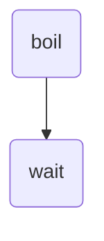
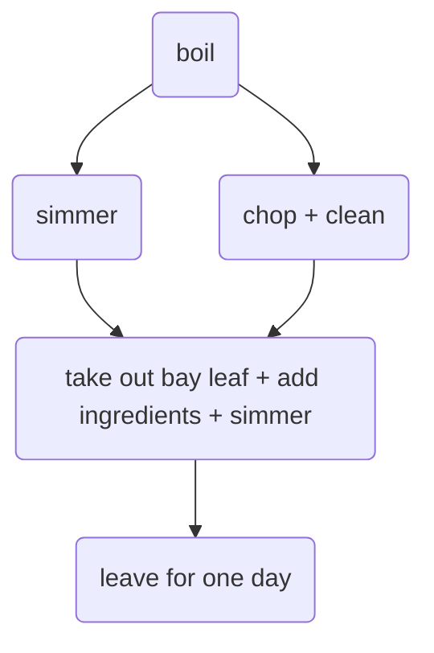
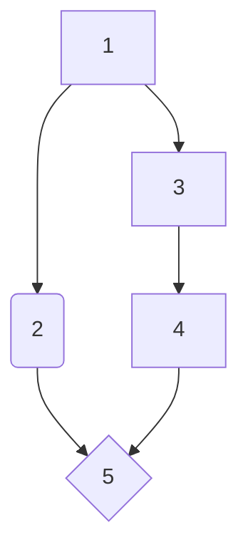

# Collaborative Document

2024-11-26 Parallel Python Workshop, Day 1

Welcome to The Workshop Collaborative Document.

This Document is synchronized as you type, so that everyone viewing this page sees the same text. This allows you to collaborate seamlessly on documents.

----------------------------------------------------------------------------


This is the Document for today: https://edu.nl/44h9b

Collaborative Document day 1: https://edu.nl/44h9b

Collaborative Document day 2: https://edu.nl/9t8yq


##  🫱🏽‍🫲🏻 Code of Conduct

Participants are expected to follow these guidelines:
* Use welcoming and inclusive language.
* Be respectful of different viewpoints and experiences.
* Gracefully accept constructive criticism.
* Focus on what is best for the community.
* Show courtesy and respect towards other community members.

## ⚖️ License

All content is publicly available under the Creative Commons Attribution License: [creativecommons.org/licenses/by/4.0/](https://creativecommons.org/licenses/by/4.0/).

## 🙋Getting help

To ask a question, just raise your hand.

If you need help from a helper, place a pink post-it note on your laptop lid. A helper will come to assist you as soon as possible.

## 🖥 Workshop website

[link](https://esciencecenter-digital-skills.github.io/2024-11-26-ds-parallel/)
[source material](https://esciencecenter-digital-skills.github.io/parallel-python-workbench/)

## 👩‍🏫👩‍💻🎓 Instructors

Francesco Nattino, Leon Oostrum, Benjamin Czaja, Johan Hidding

## 👩‍💻👩‍💼👨‍🔬🧑‍🔬🧑‍🚀🧙‍♂️🔧 Roll Call
Name/ pronouns (optional) / job, role / social media (twitter, github, ...) / background or interests (optional) / city

...

## 🗓️ Agenda
|  Time | Topic                  |
| -----:|:---------------------- |
| 09:30 | Welcome                |
| 09:45 | Introduction           |
| 10:30 | Break                  |
| 10:45 | Measuring performance  |
| 11:45 | Profiling              |
| 12:15 | Wrap-up                |
| 12:30 | Lunch                  |
| 13:30 | Computing Pi           |
| 15:00 | Coffee break           |
| 15:15 | Using Dask Array       |
| 16:00 | Tea break              |
| 16:15 | Threads and processes  |
| 16:45 | Wrap-up                |
| 17:00 | END                    |

## 🏢 Location logistics
* Coffee and toilets are in the hallway, just outside of the classroom.
* If you leave the building,
  be sure to be accompanied by someone from the escience center to let you back in through the groundfloor door
* For access to this floor you might need to ring the doorbell so someone can let you in
* In case of an emergency, you can exit our floor using the main staircase.
  Or follow green light signs at the ceiling to the emergency staircase.
* **Wifi**: Eduroam should work. Otherwise use the 'matrixbuilding' network, password should be printed out and available somewhere in the room.

## 🎓 Certificate of attendance
If you attend the full workshop you can request a certificate of attendance by emailing to training@esciencecenter.nl.
Please request your certificate within 8 months after the workshop, as we will delete all personal identifyable information after this period.

## 🔧 Exercises

### Challenge: Parallellizable and non-parallellizable tasks

Can you think of a task in your domain that is parallelizable? Can you also think of one that is fundamentally non-parallelizable?

Please write your answers in the collaborative document.

* ....
* parallellizable task: run a large earth system model where you can divide different parts in parallell
* non-parallellizable task: calculate mean of a large spatial dataset
* pararellizable: large-scale mapping using machine learnig models, non-parallelized: training time-series models
* Solving an economic dispatch optimization problem in a centralized manner is not parallelizable. However, if split into subproblems (per agent), the problem can be parallelized.
* Parallelizable: calculating Levenshtein-distances between an input and large number of strings.
* Non-parallelizable task would be one that depends on the previous timestep in a transient simulation (e.g. of water-flow)
* Parallelizable task would be doing Navier-Stokes calculations for multiple grid-cells at once during the same timestep (to calculate fluid-flow around an object for example)
* Parallel: Solving river routing in multiple basins
* Non Parallel: convolution of streamflow in a river.
* Non parallel: evolution of a system in time
* parallel: same model doing the same with different inputs
* Parallel: Applying augmentation to n number of images
* Parallel: Data ingestion
* Non-paralel: ML model tuning
* Parallelizable: Processing sea level data from global tide gauge stations
* Parallizable: Monte Carlo steps of a system with lots of degrees of freedom.
* Non-parallelizable: Dynamic Monte Carlo Simulation steps.

* Parallelizable : same simu for different sets of physical parameters (= inputs), each iteration of a given loop. non parallelizable : the comparison at the end. Resolution of PDE involving d/dt, each time step non parallelizable.
* Parallelizable : solving a PDE (e.g. Stoke's eqns for mantle flow) on a grid, by spiltting up the grid
*
* Parallelisable : post-processing multiple MD simulation frames

### Challenge: Parallelized Pea Soup

We have the following recipe:

1. (1 min) Pour water into a soup pan, add the split peas and bay leaf, and bring it to boil.
2. (60 min) Remove any foam using a skimmer, and let it simmer under a lid for about 60 minutes.
3. (15 min) Clean and chop the leek, celeriac, onion, carrot and potato.
4. (20 min) Remove the bay leaf, add the vegetables, and simmer for 20 more minutes. Stir the soup occasionally.
5. (1 day) Leave the soup for one day. Re-heat before serving and add a sliced smoked sausage (vegetarian options are also welcome). Season with pepper and salt.

Imagine you are cooking alone.

* Can you identify potential for parallelisation in this recipe?
* And what if you are cooking with a friend’s help? Is the soup done any faster?
* Draw a dependency diagram.







Solution:


You can parallelize the cutting of vegetables - but you won't get the result earlier: you are still waiting for the slowest step (the simmering).


### Challenge: Timeit

Use timeit to time the following snippets:

```python
[x**2 for x in range(100)]
```

```python
map(lambda x: x**2, range(100))
````

Can you explain the difference? How about the following

```python
for x in range(100):
    x**2
```

Is that faster than the first one? Why?

**Solution**

```python
%%timeit
[x**2 for x in range(100)]
```

```python
%%timeit
map(lambda x: x**2, range(100))
```

The second snippet is faster! `map` is lazy - it does not actually run the command, only when asking for results, it will actually compute them.

```python
%%timeit
for x in range(100):
    x**2
```

Is faster, since it does not store the output of the square operation.

## Calculating $\pi$

### Challenge: Implement the algorithm

Use only standard Python and the function random.uniform. The function should have the following interface:

```python
import random
def calc_pi(N):
    """Computes the value of pi using N random samples."""
    ...
    for i in range(N):
        # take a sample
        ...
    return ...
```
Also make sure to time your function!

**Answers**

* 3.14186736 (N=1e8)
* 3.141072 (N=1e6)
* 3.1414764 (N=1e7)
* 3.142504 (N=1e6)

**Solution**
```python
import random
def calc_pi(N):
    """Computes the value of pi using N random samples."""
    M = 0
    for i in range(N):
        # take a sample
        x = random.uniform(-1, 1)
        y = random.uniform(-1, 1)
        if x**2 + y**2 <= 1:
            M += 1
    return 4 * M / N
```
Time your function:
```python
%%timeit
calc_pi(10**7)
```

### Challenge: Daskify

Write calc_pi_dask to make the Numpy version parallel. Compare speed and memory performance with the Numpy version. NB: Remember that dask.array mimics the numpy API.

**Answers**

**Solution**
```python
import dask.array as da

def calc_pi_dask(N):
    # Simulate impact coordinates
    pts = da.random.uniform(-1, 1, (2, N))
    # Count number of impacts inside the circle
    M = da.count_nonzero((pts**2).sum(axis=0) < 1)
    return 4 * M / N

# Don't forget .compute()!
%timeit calc_pi_dask(10**7).compute()
```


### Challenge: Create a calc_pi with either Threads or Processes
Hint: use the concurrent.futures module

```python
import random
import time
import numpy as np
from concurrent import futures

def calc_pi_pool(N):
    """Computes the value of pi using N random samples."""
    M = 0
    for i in range(N):
        # take a sample
        x = random.uniform(-1, 1)
        y = random.uniform(-1, 1)
        if x**2 + y**2 <= 1:
            M += 1
    return 4 * M

num_points = 10**6
num_workers = 5
tasks = [num_points for x in range(num_workeres)]

start = time.time()

# for threads:
# ex = futures.ThreadPoolExecutor(max_workers=num_workers)
# for processes:
ex = futures.ProcessPoolExecutor(max_workers=num_workers)
result = ex.map(calc_pi_pool, tasks)
pi = sum(list(result)) / (num_workers * num_points)
end = time.time()

print(f"Time: {end-start} s")
print(f"Relative difference: with numpy pi value: {np.abs(pi / np.pi - 1)}")
```

## 🧠 Collaborative Notes

JupyterHub: https://jupyter.snellius.surf.nl/jhssrf016

### Parallel computing

Can we make the following workflow parallel?


We can! We can split the numbers we need to add in two groups, and add them independently:


If you have N cores, can you get this to run N times speedup? NO!

* There are steps that cannot be parallelized (e.g. `add` at the end)
* There is overhead from the system (running the OS, other tasks, etc.)

[**Exercise: Parallellizable and non-parallellizable tasks**](#Challenge-Parallellizable-and-non-parallellizable-tasks)

[**Exercise: Parallelized Pea Soup](#Challenge-Parallelized-Pea-Soup)

Shared memory vs distributed memory:


Multiple CPUs on the same machine can access the same memory. Different machines can also access the same data, but this cannot be done by accessing other machines' memory!

**BREAK, back at 10:45**

### Benchmarking

Sum a range of numbers:

```python
import numpy as np
result = np.arange(10**8).sum()  # summing all integers up to 10**8
```

If you try with larger numbers (e.g. `10**9`) you will run out of memory and the kernel will crash :(
Now let's try it with Dask:

```python
import dask.array as da
work = da.arange(10**8).sum()  # this does not run the computation
result = work.compute()  # this will actually run!
```

Dask allows you to setup all you calculations, and run your calculation at the very end - using parallelism as well!

How do we check which is faster? Use Jupyter magic `%%time` (will time the cell execution time):

```python
%%time
result = np.arange(10**8).sum()  # ~150 ms
```

Now with Dask:

```python
%%time
work = da.arange(10**8).sum()
result = work.compute()  # ~70 ms
```

We get ~2 speedup! If using a system monitor, you will see different CPU activity profiles: with Dask, all CPUs will be active, not with Numpy.

With `%%time`, Jupyter will run your cell only once and give you timing. Replace it with `%%timeit`  to run the cell multiple times and calculate statistics. For instance:

```python
%%timeit
result = np.arange(10**8).sum()
```

You can also assign measured time to a variable. Using `%timeit` (single `%` to time one line of code, instead of a full cell):

```python
time = %timeit -o np.arange(10**7).sum()
```

Print output as:

```python
print(f"Time taken: {time.average:.4f}s ")  # Time taken: 0.0147s
```

This tells us about how long it took, but nothing else (e.g. about memory usage)

[**Exercise: timeit**](#Challenge-Timeit)

It's also important to memory profile your code. More specific terminology:

* "benchmarking": measure performance of your code
* "profiling": which part of yout code takes longer/more memory

Let's do memory profiling for the same examples above:

```python
import numpy as np
import dask.array as da
import matplotlib.pyplot as plt
from memory_profiler import memory_usage
%matplotlib inline

def sum_with_numpy():
    np.arange(10**8).sum()

def sum_with_dask():
    da.arange(10**8).sum().compute()

memory_numpy = memory_usage(sum_with_numpy, interval=0.01)
memory_dask = memory_usage(sum_with_dask, interval=0.01)
```

Visualize results as:

```python
plt.plot(memory_numpy, label="numpy")
plt.plot(memory_dask, label="dask")
plt.xlabel("Time step")
plt.ylabel("Memory / MB")
plt.legend()
plt.show()
```

We should see Dask is done earlier (it is faster). With Dask I can also deal with bigger arrays than with Numpy - this is because of chunking! Dask will process one chunk at the time, so you can treat bigger arrays.

To figure out how many cores you have on your system. In Python:

```python
import psutil
N_physical_cores = psutil.cpu_count(logical=False)
N_logical_cores = psutil.cpu_count(logical=True)
print(f"The number of physical/logical cores are: {N_physical_cores}/{N_logical_cores}")
```

Or in a shell (on Snellius):

```python
!echo $OMP_NUM_THREADS
```

Running on your laptop you typically get different numbers - logical cores are normally twice than physical cores. This is due to **hyperthreading**: a CPU can run two threads at the same time - but only if the core is not 100% occupied. If that is the case, you better stick to the number of physical cores.

Let's now test timings using increasing number of cores:

```python
x = []
for n in range(1, 17):  # 1, 2, ..., 15, 16
    time_taken = %timeit -o -r 1 da.arange(10**8).sum().compute(num_workers=n)
    x.append(time_taken.average)
```

Let's visualize the timings:

```python
plt.plot(range(1, 17), x)
plt.xlabel("Number of CPU cores")
plt.ylabel("Time taken / s")
plt.show()
```

Beyond a certain threshold, there is not advantage in using more cores. If you ask for more workers than actual physical cores, you can actually slow down your calculation! So it's always important to benchmark your calculations!

### Profiling

Two types of profiling:
* deterministic: really get insight into the code.
* statistical: measure at fixed timesteps, less "intrusive" than the deterministic profilers.

If not in Jupyter, you can still time function executions with `time` library:

```python
import timeit

def some_function():
    total = 0
    for i in range(10**7):
        total += i
    return total

some_function()

# Measure elapsed time
elapsed_time = timeit.timeit(some_function, number=1)
```

How do you profile more complex programs? One deterministic profiler is `cProfile`:

```python
import cProfile
cProfile.run("some_function()")
```

Shows information like: how many times a function was called, how long it took, cumulative time (cumulative time spent within the function), etc.
See and compare with output of calling the function twice to mimic more complex behaviour:

```python
cProfile.run("some_function();  some_function()")
```

We can also use `memory_profiler` as line profiler:

```python
from memory_profiler import profile

@profile
def large_memory_function():
    large_list = [i**2 for i in range(10**5)]
    del large_list
    another_large_list - [j // 2 for j in range(10**5)]
    return another_large_list
```

This will actually fail - function needs to be defined **outside** Jupyter. Write it as an external file using e.g. the `%%file` magic:

```python
%%file mem.py

from memory_profiler import profile

@profile
def large_memory_function():
    large_list = [i**2 for i in range(10**5)]
    del large_list
    another_large_list - [j // 2 for j in range(10**5)]
    return another_large_list
```

Now it should work:

```python
from mem import large_memory_function
large_memory_function()
```

You see line-by-line memory profile for your piece of code.

You can also run from command line:

```python
!mprof run mem.py
```

Make a plot of the results:

```python
!mprof plto -o img.jpeg
```

Yet another time profiler: `line_profiler` . We write the snippet in a file:

```python
%%file time.py

from line_profiler import profile as time_profile

@time_profile
def some_function():
    total = 0
    for i in range(10**7):
        total += i
    return total

some_function()
```

Run it as:
```python
!kernprof -l -v time.py
```

We should see line by line time profile!

Problems for many profilers: they will typically work only for serial codes, not for parallel code. `yappi` can do that!

```python
import yappi
import threading

def some_function():
    total = 0
    for i in range(10**7):
        total += i
    return total

yappi.start()

# start the threads
threads = []
for i in range(2):
    thread = threading.Thread(target=some_function)
    thread.start()
    threads.append(thread)

# wait for threads to be done
for threads in threads:
    thread.join()

yappi.stop()
yappi.get_func_stats().print_all()
yappi.get_thread_stats().print_all()
```

You will get VERY detailed output for all function calls, as well as results aggregated over threads.

**LUNCH BREAK, back at 13:30**

### Calculating $\pi$


The baseline `calc_pi` function takes ~9s to run (see Exercises section). We will now look into different ways of optimizing the function.

First, we will create a numpy implementation. Numpy can operate on a whole vector of numbers at once. This way of parallelization is called *vectorization*.

```python
import numpy as np

def calc_pi_numpy(N):
    # take all samples
    pts = np.random.uniform(-1, 1, (2, N))
    M = np.count_nonzero((pts**2).sum(axis=0) <= 1)
    return 4 * M / N
```

Time the function:
```python
%%timeit
calc_pi_numpy(10**7)
```
The result is ~250ms, about 40 times faster than the naive Python implementation! It is however much less readable and harder to modularize. In real-world code, this is often a tradeoff to be made.
The numpy version also uses a lot more memory, as it creates a big `2 * N` array instead of generating values one by one.

#### Introduction to Dask
Dask can run on a single CPU, multi-core system, as well as in a distributed way on a supercomputer. We do not go into the distributed setup in this course.

Dask has many different interfaces: array (mimics numpy) DataFrame (mimics pandas), and several more. Whatever interface you use, Dask creates a task graph based on the code you type, and then runs this series of tasks on one or more CPUs using a task scheduler.

The dask version of `calc_pi` is a litle bit slower than numpy for N = $10^7$.

```python
import dask.array as da

N = 10**7
pts = da.random.uniform(-1, 1, (2, N))
pts
```
In the visualization we can see that Dask uses 2 chunks. The first chunk is 128 MiB, the second one much smaller. There are only 2 chunks, not enough for good parallelism on a many-core CPU. We can explicitly set the chunk size:

```python
pts = da.random.uniform(-1, 1, (2, N), chunks=10**6)
pts
```
We now have 10 chunks, each of size $10**6$ elements.

Using this, and explicitly setting the amount of workers:
```python
def calc_pi_dask(N):
    # Simulate impact coordinates
    pts = da.random.uniform(-1, 1, (2, N), chunks=10**6)
    # Count number of impacts inside the circle
    M = da.count_nonzero((pts**2).sum(axis=0) < 1)
    return 4 * M / N

%timeit calc_pi_dask(10**7).compute(num_workers=16)
```
It can run in <100 ms this way, so over twice as fast as the original dask implementation.

Visualize a large set of 2D chunks, setting the amount of elements per chunk in each axis:
```python
da.random.random((10000, 10000), chunks=(1000, 1000))
```
This can be useful when you need to e.g. do a reduction, which is a lot faster within a chunk than across chunks.

## Threads and processes

### Introduction to CPU architecture: a history lesson
Moore's law: prediction on increasing transistor count per chip per year: doubling every two years.
Starting around 2010, the number of cores per CPU started to increase.

Parallelism started to appear in the '90s, Python in 1991, predating most parallelism implementation in e.g. operating systems!

### von Neumann architecture
A computer consists of a few elements: memory, logic, control unit.


In a multi-core system, this architecture looks more like this:


Get information about the cpu in a (linux) machine:
```python
!lscpu
```
On the Snellius Jupyter hub, you can see that there are two sockets with one 64-core AMD CPU each. The amount of threads per core is one, i.e. hyperthreading is disabled.

Details about the amount of CPUs actually assigned to the Jupyter Hub server:
```python
!numactl --show
!hostname
```

### The Python interpreter
The Python language is written in another language. The most common implementation, CPython, is written in C.


#### The global interpreter lock
The Global Interpreter Lock (GIL) prevents multiple threads from executing Python code at the same time. It prevents race conditions and makes the interpreter thread-safe.


The GIL is a problem when parallelizing code. How can we circumvent this?
1. Run multiple Python instances
2. Run code outside of Python: OS operations such as I/O, C++ extensions, etc.

### Threads, Processes, and Python

Multiprocessing opens a whole new Python interpreter for each process. Multithreading doesn't do this, the threads run within the same interpreter and share memory. But, only one thread can access specific memory at a time.

Threading example


```python
%%writefile simple_thread.py
import threading
import time
import os

def worker(i):
    """Simple function that sleeps"""
    print(f"I am thread {threading.current_thread().name}")
    print(f"I have this process ID: {os.getpid()}")
    print(f"There are {len(threading.enumerate())} active threads")
    time.sleep(i)
    print(f"And I slept for {i} seconds")

#worker(4)  # sleeps for 4 seconds
t1 = threading.Thread(target=worker, args=[3])
t1
```
Printing the thread shows the target function name and thread id, as well as the thread's status.

```python
t1 = threading.Thread(target=worker, args=[3], name="Thread1")
t2 = threading.Thread(target=worker, args=[5], name="Thread2")

t1.start()
t2.start()
```

Jupyter itself uses threads, so there will be many threads when you run this code. Running it in a separate file, you can see that there is always a main thread, and additionally the threads you spawned yourself.

Now let's do something similar with multiprocessing

```python
%%writefile simple_process.py
import multiprocessing
import threading
import time
import os

def worker(i):
    """Simple function that sleeps"""
    print(f"I am thread {threading.current_thread().name}")
    print(f"I have this process ID: {os.getpid()}")
    print(f"There are {len(threading.enumerate())} active threads")
    time.sleep(i)
    print(f"And I slept for {i} seconds")

p1 = multiprocessing.Process(target=worker, args=[3], name="Process 1")
p2 = multiprocessing.Process(target=worker, args=[1], name="Process 2")

p1.start()
p2.start()

p1.join()
p2.join()
```

### Threads and processes in practice: concurrent.futures
With the concurrent.futures module you can easily use either threads or processes. This is done through a pool of workers.

The module provides two types of classes for interacting with the pools:
* Executors are used for managing pools of workers.
* Futures are used for managing results computed by the workers.

```python
%%writefile simple_futures.py
from concurrent import futures
import threading
import time
import os

def worker(i):
    """Simple function that sleeps"""
    print(f"I am thread {threading.current_thread().name}")
    print(f"I have this process ID: {os.getpid()}")
    print(f"There are {len(threading.enumerate())} active threads")
    #print(f"These are the active threads: {threading.enumerate()}")
    time.sleep(i)
    print(f"And I slept for {i} seconds")

    return i

tasks = [1, 2, 3]
ex = futures.ThreadPoolExecutor(max_workers=3)

result = ex.map(worker, tasks)
print(result)  # Executor object, can be printed before all threads finish
real_result = list(result)  # block until all results are present, then convert to a normal list
```

```python
!python simple_futures.py
```

## 📚 Resources

* [Dask profiling tools](https://distributed.dask.org/en/latest/diagnosing-performance.html)
